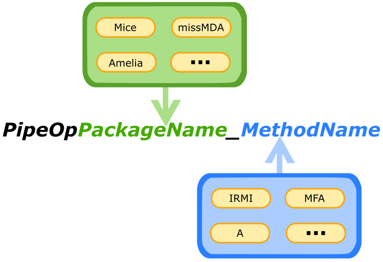

 

```{r schunk, setup, include=FALSE}
knitr::opts_chunk$set(include = FALSE)
library(NADIA)
```

## Function naming 
NADIA implements imputation at the form of mlr3pipeline functions, with a structure like this:
```{r ochunk, echo=FALSE, fig.align='center', include=TRUE, out.width='100%'}

```

Package name can be replaced by the name of the simple method like *Sample*. Method names can also be the labels of the approach for example *Sample_B* or *Mice_A*. This simple convention is implemented by all PipeOp functions in NADIA and simplify access to advance imputation methods even more.

## Why errors apera and why so many? 


As I mention in *Basic_Examples* NADIA mainly use the B approach. Presented in the diagram below.


```{r wchunk, echo=FALSE, fig.align='center', include=TRUE, out.width='100%'}

```


 Because of that data can often prove to be problematic. Imputation can fail because of one of the below problems:
- In the testing set at least one column contains only NA (for some packages problem appear also when the feature contains the only one no missing value),
- Testing set is too small to perform imputation (this can happen for example, when cross-validation is performed with a high number of folds),
- Imputation can fail because of a mathematical problem with the algorithm (for example too high correlation between variables).

## Statiscit 

Tests were performed using data from openML because this assure variety in data sets. We used methods already implemented in **mlr3pipelines** to remove constant variables and categorical features containing too many unique classes. Data sets were tested automatically that's mean no individual preprocessing. Lack of special preprocessing leads to low statistics in the case of **Amelia** because this package often suffers because of highly correlated variables. We define success as a situation when **ALL** missing data in the dataset was imputed. In tests, we didn't check the quality of the imputation. The result is presented in the table below:

```{r pchunk, echo=FALSE, warning=FALSE, include=TRUE, out.width='70%'}

benchmark_data <- read.csv("benchmark_2-packages.csv")
benchmark_data <- benchmark_data[1:28,]
benchmark_data <- benchmark_data[,-ncol(benchmark_data)]

task_number <- 25

succes <- as.numeric(as.character(unlist(benchmark_data[27,-1,drop=TRUE])))


methods <- colnames(benchmark_data[,-1])

methods <- substr(methods,start = 7,stop = 999)


Resoults <- as.data.frame(matrix(nrow = 2,ncol = 11))

row.names(Resoults) <- c("Succesful tasks","Percent of succesful tasks")
colnames(Resoults) <- methods

Resoults[1,] <- paste(succes,task_number,sep = "/")

Resoults[2,] <- paste0(round(succes/25*100,2),"%")
res<- cbind(methods,t(Resoults))
row.names(res) <- NULL
colnames(res)[1] <- "Package_method"


`%>%` <- magrittr::`%>%`

knitr::kable(res,escape = FALSE,format = 'html',caption = "NADIA test results") %>% kableExtra::column_spec(1:3,bold=TRUE) %>% kableExtra::row_spec(c(1,9),color = "white",background = "#FF5733") %>% kableExtra::row_spec(c(2,4,5,11),color = "white",background = "#F5A9A9")
```

These results can look unappealing, but data weren't treated individually. For example, removing highly correlated variables should significantly improve results with weaker packages.

## More aboute error hendling 

In the previous section we show thats  errors are something what's need to be considered important with imputation. Luckily **mlr3pipelines** implements a method of handling them.
All types of **Learners** have a field call *encapsulate* responsible for this. More about how its work in examples below:

```{r Lrn, cache=TRUE, include=FALSE}


graph <- PipeOpMice$new()%>>% lrn('classif.debug')

Learner <- GraphLearner$new(graph)


Learner$param_set$values$classif.debug.error_train	=1 
Learner$param_set$values$classif.debug.error_predict	=1 
```


### Evalutae 
**Evaluate** package allows the user to handle accruing errors in the current R session. For example, we use cross-validation it can be understood like this. Every fold is running in a separate try-catch. It's not how it works from a technical perspective, but can be understood like this. \
A quick example of using **evaluate**:


```{r d, echo=TRUE, include=TRUE,cache=TRUE, dependson=-1}

# Encaplustion with Evalute
Learner$encapsulate=c(train="evaluate",predict="evaluate")


# Resampling with errors and presenting errors
resample(tsk("pima"),Learner,rsmp("cv",folds=5))$errors

```
### Callr 


**Callr** package allows you to run every fold in a separate session. This can be used exactly like **evaluate** but in some cases is more powerful. For large data frames (over 100000 rows) packages like **mice** and **Amelia** can sometimes crash the entire R session. In that situation, tryCatch or **evaluate** isn't enough and you need to use **caller**.
It can be quite tricky to correctly pass seeds to **callr** session in detail is best to check [mlr3 book](https://mlr3book.mlr-org.com/error-handling.html).


This is how **callr** can be used (in this case we don't simulate the session crash because it will be hard to achieve reliably on every machine):
 
```{r kchunk,dependson=-1,cache=T ,echo=TRUE,dependson=-1,include=TRUE}

# encaplustion with callr
Learner$encapsulate=c(train="callr",predict="callr")


# Resampling with errors and presenting errors
resample(tsk("pima"),Learner,rsmp("cv",folds=5))$errors


```


It also worth to see  the time difference between the two packages :\ 
 
 - **Evaluate**: 4.12s
 - **Callr**: 20.41s 

The difference may look huge, but in the case of a larger data set (when we mainly want to use **callr**) value of the difference stays approximately the same and starting to be irrelevant when imputation takes for example 20h.

## Conclusion 
Errors will appear in the case of using statistical methods on real data. NADIA implements the best possible methods to handle them, but in the end. The best way to solve any issue is individual approach for each data set, maybe removing irrelevant columns or scaling data. It all depends on a used package and data structure.
