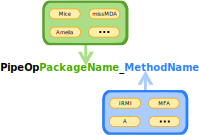

```{r, include = FALSE}
knitr::opts_chunk$set(
  collapse = TRUE,
  comment = "#>"
)
```

```{r setup, include=FALSE}
knitr::opts_chunk$set(include = FALSE)
library(NADIA)
```

## Function naming 
NADIA implements imputation in form of **mlr3pipeline** function have structure like this: 
```{r echo=FALSE, fig.align='center', include=TRUE, out.width='100%'}

```

Pakcage names alsowe work as name of simple methods like Sample. Method names can alsow be name of aproche for example Sample_B or Mice_A. This simple convention 
is implemented by all PipeOp function in NADIA and simplify acces to adance imputation methods even more.

## Why errors apera and why so many 


As I mensioni in Basic examples NADIA mainaly use B aproche:


```{r echo=FALSE, fig.align='center', include=TRUE, out.width='100%'}
knitr::include_graphics('B.svg')
```


Prezented on digram above becouse of that data can offen acoure problematic. Imputation can fail becosue one of the belowes problems: 

 - in testing set some features contains only NA (for some packages problem appere alsow when feature contains only one no missing valuse),
 - testing set is to samll to perform imputation (this can heppend for example when corss-validacion is perform with hight number of folds),
 - imputation can faile becoue of mathematical problem with algorithm (for example too hight corelation betwen veribles).
 
This and other possibel isuese can't be soleve in NADIA package becouse are directly conected with imputation itself not interface around. Errors happen even more offen becouse aproche B when imputation has to be trained two times. To showe u how many errors you can expect we perform tests and present results in next section.

## Statiscit 

Tests was perform using data from openML becouse of this datasets was varied. We used implemented in **mlr3pipelines** methods to remove constant veribles and categorical fetures containing to mnay unic classes. Datasets were tested automaticly thats mean no indyvidula preprocesing. Lack of preprocesing leads to vary low statisits in casa of Amelia becouse this package offen suffer form highly corelaited veribles. We define success sutuation when **ALL** missing data in dataset was imputed. In this tests we dont check qulitty of the imputation. Result are presented in table bellow:


```{r echo=FALSE, include=TRUE,out.width='70%'}
# library(magrittr)
# library(kableExtra)
# benchmark_data <- read.csv("/home/jan/Pobrane/benchmark_2 - packages.csv")
# benchmark_data <- benchmark_data[1:28,]
# benchmark_data <- benchmark_data[,-ncol(benchmark_data)]
# 
# task_number <- 25
# 
# succes <- as.numeric(as.character(unlist(benchmark_data[27,-1,drop=TRUE])))
#                      
# 
# methods <- colnames(benchmark_data[,-1])
# 
# methods <- substr(methods,start = 7,stop = 999)
# 
# 
# Resoults <- as.data.frame(matrix(nrow = 2,ncol = 11)) 
# 
# row.names(Resoults) <- c("Succesful tasks","Percent of succesful tasks")
# colnames(Resoults) <- methods
# 
# Resoults[1,] <- paste(succes,task_number,sep = "/")
# 
# Resoults[2,] <- paste0(round(succes/25*100,2),"%")
# res<- cbind(methods,t(Resoults))
# row.names(res) <- NULL
# colnames(res)[1] <- "Package_method"
# 
# 
# 
# knitr::kable(res,escape = FALSE,format = 'html',caption = "NADIA test resoults") %>% column_spec(1:3,bold=TRUE) %>%row_spec(c(1,9),color = "white",background = "#FF5733") %>%row_spec(c(2,4,5,11),color = "white",background = "#F5A9A9") 
```

This reloults can look unapiling but data wasnt treated indyvidualy. For example removing highly corelated veribels shoude mainaly imprve results with weeker pacakges. 


## More aboute posible error and its masages


## More aboute error hendling 


In previuse secsion we showe errors are somthing whats neet to be considerd working with imputation. Luckly **mlr3pipelines** implements method of hendling them.
All types of lerners have a filde call *encapsulate* rosponsible for this. More abuote how its work in examples bellow:

```{r Lrn, cache=TRUE, include=FALSE}


graph <- PipeOpMice$new()%>>% lrn('classif.debug')

Learner <- GraphLearner$new(graph)


Learner$param_set$values$classif.debug.error_train	=1 
Learner$param_set$values$classif.debug.error_predict	=1 
```


### Evalutae 
Evalute pacakge allowe user to hendel accuring errors in current R sesion. For exapmle of we use corss-validation its can be understending like this. Every fold 
is runing in separate tryCatch. Its not how its work form technikal perspective but can be understending like this.
Qucit example of using evalute:


```{r d ,dependson=-1,cache=T ,echo=TRUE,dependson=-1}


# encaplustion with Evalute 
Learner$encapsulate=c(train="evaluate",predict="evaluate")


# Resampling wit errors
 resample(tsk("pima"),Learner,rsmp("cv",folds=5))

```
Errors masage are saved as

