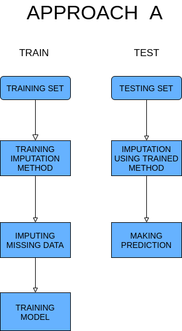
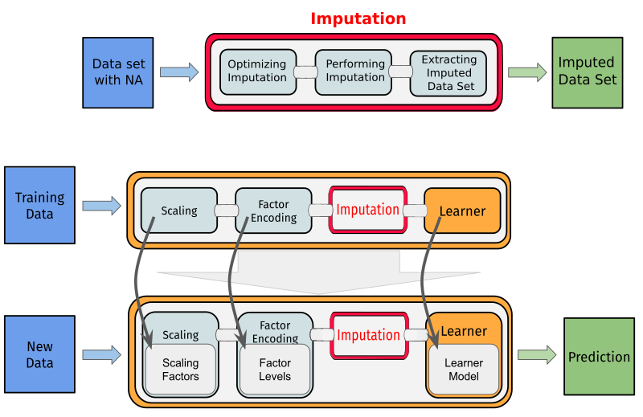

<style>
body {
text-align: justify}
</style>

```{css, echo=FALSE}
.code {
  font-size: 98% ;
}
```

```{r, include = FALSE}
knitr::opts_chunk$set(
  collapse = TRUE,
  comment = "#>"
)
```

```{r setup,include=FALSE}
knitr::opts_chunk$set(
	message = FALSE,
	warning = FALSE,
	include = FALSE
)
library(NADIA)
```


## Motivation behind NADIA 

In R we have access to a variety of complex methods to impute missing data. For example, we can use complex statistical algorithms like **EMB** (Expectation–maximization with bootstrap) implemented by Amelia package or machine learning approach in the form of  **RandomForest** implemented by missForest.

Problems appear when u want to use one of these methods in machine learning workflow or just include them in bigger scripts. All of these packages have different implementation for example most of them return different objects. In NADIA we try to automatize the process of using these packages (including available methods to improving imputation). We create uniform interface for the following packages **Amelia**, **mice**, **missMDA**, **missForest**, **missRanger**, **VIM**, **softImpute**. To allow the user easy access to all methods in machine learning workflow we implemented them as operators in **mlr3pipelines** [@mlr3pipelines].

## Installation 

From Github: 
```{r, include=TRUE,eval=FALSE,class.source="code"}
devtools::install_github("https://github.com/ModelOriented/EMMA/", subdir = "NADIA_package/NADIA")

```

From CRAN: 
```{r echo=TRUE,include=TRUE,eval=FALSE}
install.packages("NADIA")

```

## Packages included in NADIA 

**Amelia** [@Amelia] is a commonly used implementation of Expectation-maximization with bootstrap. By default, this package implements multiple imputations. In the case of **mlr3pipelines** operators, we have to choose one from produced data sets. **Amelia** can impute categorical and continuous variables. 

**mice** [@mice] (Multiple imputation using chain equations) is another popular package to work with missing data. In our implementation, we use linear models to evaluate and improve imputation, **mice** can be used in two possible approaches.

**missMDA** [@missMDA] package implements methods, especially useful when you want to use PCA or similar after imputation. Because of the number of methods, imputation from this package was separated into two functions:

 - The first function implements three complementary methods:
 
    - *PCA* (Principal Components Analysis) used when data contains only continuous features 
    - *MCA* (Multiple Correspondence Analysis) used when data contains only categorical features 
    - *FMAD* (Factorial Analysis for Mixed Data) used when data contains mixed features

 - Second function implements *MFA* (Multiple Factor Analysis) which can be used for all types of data. 
 
 **missForest** [@missForest] uses machine learning to impute missing data. In this package, the random-forest model is trained on data with missing values and used to perform imputation. 
 
 **missRanger** [@missRanger] is an improved version of missForest where Predictive Mean Matching is added between random-forest iterations. This firstly avoids imputation with values not already present in the original data. Secondly, predictive mean matching tries to raise the variance in the resulting conditional distributions to a realistic level.
 
 **VIM** [@VIM] implements four different imputation methods implemented in separate functions: 
 
  - *Hot-Deck* Data set is sorted and missing values are imputed sequentially running through the data set line (observation) by line (observation). Fast and simple imputation method,
  - *IRMI* (Iterative robust model-based imputation) In each step of the iteration (inner loop), one variable is used as a response variable and the remaining variables serve as the regressors. The procedure is repeated until the algorithm converges (outer loop),
  - *kNN* (k nearest neighbors) An aggregation of the k values of the nearest neighbors is used as an imputed value. Functions used to aggregate neighbors can be pass as arguments, 
  - *Regression Imputer* train linear models using column without missing as features and column with missing as a target. 
  
  **softImpute** [@softImpute] imputation base on the operation on matrixs. Fast but limited to numeric variables so has to be used alongside some simple imputation method for categorical variables. This imputation function can be pass as an argument. 

## Approaches A and B

In standard machine learning, the model is first trained on training data. Then a trained model is used to predict new data. This workflow is recommended and should be used when it's possible. We call this approach A and present it in the diagram below:

```{r echo=FALSE, out.width='50%', include=TRUE,fig.align='center'}

```

Problems start appearing when we want to include advanced imputation methods in this approach. The majority of used packages don't allow to separated training stage from the imputation stage (expect **mice** more about this in the next section). Because of this, we have to use something we called approach B. In this case, imputation work separately on training and test sets but the rest of the model is trained the same as in approach A. B approach is presented in the diagram below:

```{r echo=FALSE, fig.align='center', include=TRUE, out.width='50%'}

```

Approach B has obvious limitations for example it's impossible to predict only one example because imputation techniques don't work for too small samples. Approach B can be beneficial in case when training data has different distributions then testing data. This situation can happen when training is perform using historic data. 

## Mice in A approach


Not all included packages are limited to approach B. We can use **mice** in the A approach using simple tricks. First perform imputation on training data and then use trained imputer on the testing set. To avoid data leak we remove the real values from the testing data set when imputation is performed. These data are added back after imputation. By doing that we allow testing on only one example and avoid all problems with a small test sample size. This approach to **mice** is available with all mice methods.

## Usage example and mlr3 integration 

All included packages are available in form of **mlr3pipelines** operator so can be used like this: 


```{r chunk1, class.source="code", include=TRUE, paged.print=TRUE,cache=TRUE}
# Task with missing data from mlr3
task_with_missing <- tsk('pima')


# Creating an operator implementing the imputation method
imputation_methods <- PipeOpMice$new()

# Imputation
task_with_no_missing <- imputation_methods$train(list(task_with_missing))[[1]]

#Check

task_with_missing$missings()

task_with_no_missing$missings()

```

But the real advantage of using NADIA comes from integration with mlr3 [@mlr3]. Because of that, we can easily include advanced imputation techniques inside the machine learning models. For example:


```{r chunk2, include=TRUE, class.source="code",cache=TRUE}
library(mlr3learners)

# Creating graph learner

# imputation method 
imp <- PipeOpmissRanger$new()


# learner 
learner <- lrn('classif.glmnet')

graph <- imp %>>%  learner

graph_learner <- GraphLearner$new(graph, id = 'missRanger.learner')
graph_learner$id <-  'missRanger.learner'
# resampling 
set.seed(1)
resample(tsk('pima'),graph_learner,rsmp('cv',folds=5))
```

Advanced imputation technics often can cause errors. NADIA use mlr3's methods to handle that:

```{r chunk3,include=TRUE, dependson= -1 , class.source="code",cache=TRUE}
# Error handling 
graph_learner$encapsulate <- c(train='evaluate',predict='evaluate')

# Creating a problematic task
data <- iris

data[,1] <- NA

task_problematic <- TaskClassif$new('task',data,'Species')


# Resampling 

# All folds will be tested and the script run further

set.seed(1)
resample(task_problematic,graph_learner,rsmp('cv',folds=5))

  

```

We want to include any form of imputation tuning provided by used packages in our functions. It not possible for every package but it can be used in for example missRanger:

```{r chunk4, include=TRUE,dependson=-2 , class.source="code",cache=TRUE}

# Turning off encapsulation 
graph_learner$encapsulate <- c(train='none',predict='none')

# Turning on optimalization 
graph_learner$param_set$values$impute_missRanger_B.optimize <- TRUE


# Resampling 
set.seed(1)
resample(tsk('pima'),graph_learner,rsmp('cv',folds=5))

```
Using optimization slows the whole especially in approach B when imputation has to optimize separately on training and test sets.

NADIA also implements simple imputation methods like median or mean in approach B. For example: 

```{r include=TRUE , class.source="code",cache=TRUE}

# Creating graph learner

# imputation method 
imp <- PipeOpMean_B$new()

# learner 
learner <- lrn('classif.glmnet')

graph <- imp %>>% learner

graph_learner <- GraphLearner$new(graph)
graph_learner$id <-  'mean.learner'
# resampling 
set.seed(1)
resample(tsk('pima'),graph_learner,rsmp('cv',folds=5))

```


## Why NADIA
NADIA gives the user very easy access to advance imputation techniques scattered on many packages. Also, simplify using these techniques and provide a high level of automatization in using them. Beyond that NADIA implements functions to simulate missing data. This can be especially useful to compare imputation methods with each other.

For example, I will perform two folds cross-validation using **missMDA** and calculate mean accuracy on simple data set with and without NADIA.


Without NADIA: 
```{r echo=TRUE,include=TRUE}
library(missMDA)
library(mlr3learners)
# Using task form mlr3 
task <- tsk("pima")

# I can't perform imputation on task so I have to extract data frame  

data <- as.data.frame(task$data())

# Splitting into two sets and removing the target column 

indx <- sample(1:nrow(data),nrow(data)/2)

data1 <- data[indx,-1]

data2 <- data[-indx,-1]

##  Performing imputation with optimization
 
  # Features are only numeric so I will use PCA this has to be checked 
  # Optimization  

ncp1 <- estim_ncpPCA(data1)$ncp

ncp2 <- estim_ncpPCA(data2)$ncp
 
  # Imputation 

data1 <- as.data.frame(imputePCA(data1,ncp1)$completeObs)

data2 <- as.data.frame(imputePCA(data2,ncp2)$completeObs)

# Adding back target column 

data1$diabetes <- data$diabetes[indx]

data2$diabetes <- data$diabetes[-indx]

# Creating new tasks to make a prediction 

task1 <- TaskClassif$new("t1",data1,"diabetes")

task2 <- TaskClassif$new("t2",data2,"diabetes")

# Training, prediction, and evaluation  
# Fold1 
learner <- lrn("classif.glmnet")

learner$train(task1)

p2 <- learner$predict(task2)

acc2 <- p2$score(msr("classif.acc"))

# Fold2
learner <- lrn("classif.glmnet")

learner$train(task2)

p1 <- learner$predict(task1)

acc1 <- p1$score(msr("classif.acc"))

# Mean acc
(acc1+acc2)/2
```

With NADIA: 
```{r echo=TRUE,include=TRUE}
library(mlr3learners)
# Using task form mlr3 
task <- tsk("pima")

# Imputation, training, prediction, and evaluation 

graph <- PipeOpMissMDA_PCA_MCA_FMAD$new() %>>% lrns("classif.glmnet")

graph_learner <- GraphLearner$new(graph)

graph_learner$id <- 'learner'

rr <- resample(task,graph_learner,rsmp("cv",folds=2))

rr$aggregate(msr("classif.acc"))

```

As we can see NADIA automatizes the whole process and allow you to easily include imputation techniques in your machine learning models.

## References

