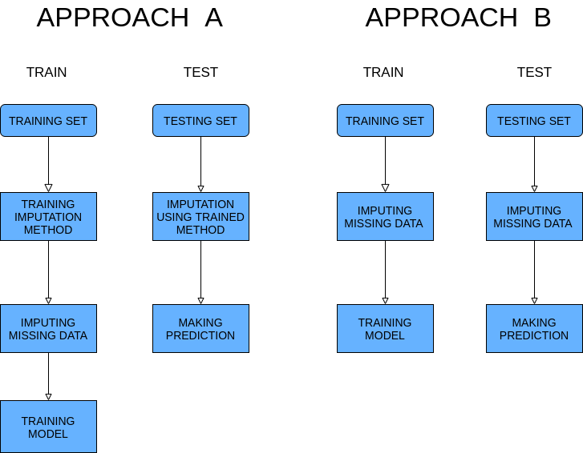

<style>
body {
text-align: justify}
</style>

```{css, echo=FALSE}
.code {
  font-size: 80% ;
}
```

```{r, include = FALSE}
knitr::opts_chunk$set(
  collapse = TRUE,
  comment = "#>"
)
```

```{r setup,include=FALSE}
knitr::opts_chunk$set(
	message = FALSE,
	warning = FALSE,
	include = FALSE
)
library(NaDIA)
```


## Motivation behaind NaDIA 

In R we have access to a variety of complex methods for imputing missing data. For example, we can use complex statistical algorithms like **EMB** (Expectation–maximization with bootstrap) implemented by Amelia package or machine learning approaches in the form **RandomForest** implemented by missForest.

Problems appear when u want to use one of these methods in machine learning workflow or just include them in bigger scripts. All of these packages have different implementation for example most of them return different objects. In NaDIA we try to automatize the process of using these packages (including available in packages forms of improving imputation). We create uniform interface for the following packages **Amelia**, **mice**, **missMDA**, **missForest**, **missRanger**, **VIM**, **softImpute**. To allow the user easy access to all methods in machine learning workflow we implemented them as operators in mlr3pipelines. More about implementation problems and decisions can be read in the next section.

## Aproches A and B

In the case of normal machine learning, we used to train first on the training set and then make a prediction using the testing set we call that approach A. In the case of almost all included packages (expect mice more about this in the next section) this approach is impossible so we use something we call approach B where we exclude imputation from normal machine learning workflow. That's basically mean imputation is trained separately on train and test data. 


```{r echo=FALSE, out.width='100%', include=TRUE, fig.align='center'}

```


Only imputation works separately and in prediction, the model doesn't have any access to training data so problems with data leak don't appear. This approach has obvious limitations for example it's impossible to predict only one example because imputation methods don't work for a small sample. On the other side, this method can be beneficial in case when training data have different distribution then testing. This can happen when we use historic data for training. 


## Mice in A aproche

Not all included packages are limited to approach B. We can use **mice** in the A approach using simple tricks. We first perform imputation on training data and then use trained imputer on the testing set. To avoid data leak we remove the real values from the testing data set when imputation is performed. These data are added back after imputation. By doing that we allow testing on only one example and avoid all problems with a small test sample size. This approach to **mice** is available with all mice methods.

## Using example and mlr3 integration 

All included packages are available in form of **mlr3pipline** operator so can be used like this: 


```{r chunk1, echo=TRUE, include=TRUE , cache=TRUE, class.source="code"}
# Task with missing data from mlr3
task_with_missing <- tsk('pima')

task_with_missing$missings()

# Creating an operator implementing the imputation method
imputation_methods <- PipeOpMice$new()

# Imputation
task_with_no_missing <- imputation_methods$train(list(task_with_missing))[[1]]

task_with_no_missing$missings()

```

But the real advantage of using PACAKGENAME comes from integration with mlr3. Because of that, we can easily include advanced imputation techniques inside the machine learning models. For example:


```{r chunk2, include=TRUE,cache=TRUE , class.source="code"}
library(mlr3learners)

# Creating graph learner

# imputation method 
imp <- PipeOpmissRanger$new()

# encoder 
encoder <- PipeOpEncodeImpact$new()

# learner 
learner <- lrn('classif.glmnet')

graph <- imp %>>% encoder %>>% learner

graph_lerner <- GraphLearner$new(graph, id = 'missRanger.learner')

# resampling 
set.seed(1)
resample(tsk('pima'),graph_lerner,rsmp('cv',folds=5))
```

Advanced imputation technics often can cause errors. NaDIA use mlr3 methods to handle that:

```{r chunk3,include=TRUE, dependson= -1 ,cache=TRUE, class.source="code"}
# Error handling 
graph_lerner$encapsulate <- c(train='evaluate',predict='evaluate')

# Creating a problematic task
data <- iris

data[,1] <- NA

task_problematic <- TaskClassif$new('task',data,'Species')


# Resampling 

# All folds will be tested and the script run forward 

set.seed(1)
resample(task_problematic,graph_lerner,rsmp('cv',folds=5))


```

We want to include any form of imputation tuning provided by used packages in our functions. It not possible for every package but it can be used in for example missRanger:

```{r chunk4, include=TRUE,dependson=-2 ,cache=TRUE, class.source="code"}

# Turning off encapsulation 
graph_lerner$encapsulate <- c(train='none',predict='none')

# Turning on optimalization 
graph_lerner$param_set$values$impute_missRanger_B.optimize <- TRUE


# Resampling 
set.seed(1)
resample(tsk('pima'),graph_lerner,rsmp('cv',folds=5))

```
Of course, using optimization slows imputation especially in approach B when imputation has to optimize separately on training and test sets.

NaDIA also implements simple imputation methods like median or mean in approach B. For example: 


```{r include=TRUE ,cache=TRUE, class.source="code"}

# Creating graph learner

# imputation method 
imp <- PipeOpMean_B$new()

# encoder 
encoder <- PipeOpEncodeImpact$new()

# learner 
learner <- lrn('classif.glmnet')

graph <- imp %>>% encoder %>>% learner

graph_lerner <- GraphLearner$new(graph)

# resampling 
set.seed(1)
resample(tsk('pima'),graph_lerner,rsmp('cv',folds=5))

```


## Why NaDIA
NaDIA give user vary easy access to advance imputation techniques scattered on many packages. Also, simplify using these techniques and provide a high level of automatization in using them. Byone that NaDIA implements functions to simulate missing data. This can be especially useful to compare imputation methods with each other. NaDIA is a good way to connects imputation packages with machine learning in R.

